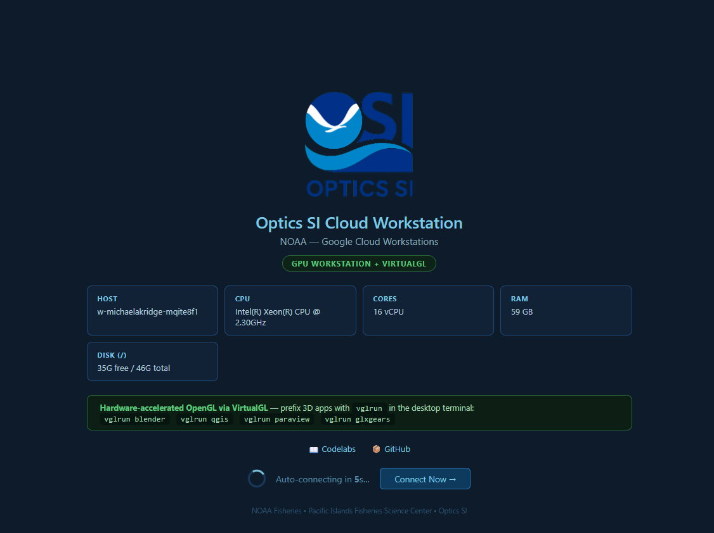
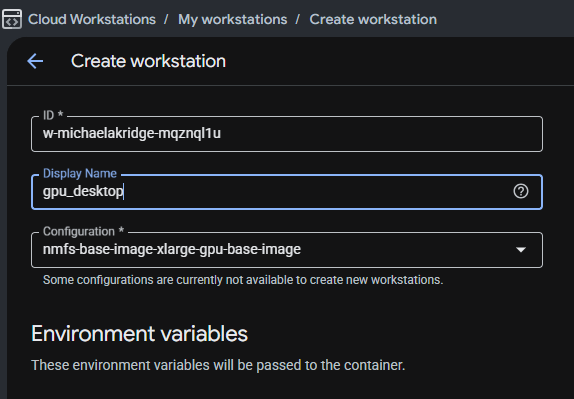
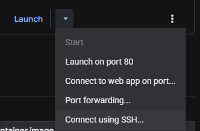
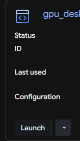

# Optics SI Cloud Desktop (GPU) Workstation Setup
id: desktop-gpu-persistent-setup
title: Optics SI Cloud Desktop (GPU) Workstation Setup
summary: Install the persistent GPU desktop setup script for Cloud Workstations with wget, chmod, and sudo execution.
authors: Michael Akridge
categories: Cloud Workstation, GPU, Setup
environments: Web
status: Published
tags: cloud-workstations, gpu, desktop, virtualgl, setup, persistence
feedback link: https://github.com/MichaelAkridge-NOAA/optics-si-cloud-tools/issues

## Overview
Duration: 2

This codelab installs a persistent GPU-enabled desktop environment on a Google Cloud Workstation using:

- XFCE desktop
- TigerVNC + noVNC
- VirtualGL for GPU-accelerated rendering (`vglrun`)
- Persistent autostart across workstation stop/start cycles



### Script source

- GitHub link: https://github.com/MichaelAkridge-NOAA/optics-si-cloud-tools/blob/main/scripts/setup_desktop_gpu_persistent.sh

## Create a GPU Workstation (Important)
Duration: 2

When you create your Cloud Workstation, select a **GPU-enabled base image/configuration**.

- Use a workstation config that includes an NVIDIA GPU (for example, T4/L4).
- If you choose a CPU-only base image, `nvidia-smi` and `vglrun` acceleration will not be available.
- Confirm the workstation can see the GPU after startup with `nvidia-smi`.



## Connect via SSH
Duration: 1

Before running install commands, connect to the workstation with SSH from Cloud Workstations.

In the Cloud Workstations UI, open your workstation actions dropdown and use **Connect using SSH...** to copy the exact connect command for your workstation and paste in command terminal on local machine.



After connecting, continue with the download and install steps below.


## Download the Script with wget
Duration: 2

Use `wget` to download the installer to your workstation:

```bash
cd ~
wget -O setup_desktop_gpu_persistent.sh \
  https://raw.githubusercontent.com/MichaelAkridge-NOAA/optics-si-cloud-tools/main/scripts/setup_desktop_gpu_persistent.sh
```


## Make the Script Executable
Duration: 1

```bash
chmod +x setup_desktop_gpu_persistent.sh
```

You should see executable permissions (for example: `-rwxr-xr-x`).

## Run the Installer with sudo
Duration: 8

Run the script with `sudo` so system packages/services can be configured:

```bash
sudo ./setup_desktop_gpu_persistent.sh
```

The script installs and configures:

- XFCE + TigerVNC + noVNC on port `80`
- NVIDIA/VirtualGL support (best effort)
- Persistent startup hooks in your home directory

## Optional One-Liner Install
Duration: 1

If you prefer not to keep a local copy first:

```bash
curl -sL https://raw.githubusercontent.com/MichaelAkridge-NOAA/optics-si-cloud-tools/main/scripts/setup_desktop_gpu_persistent.sh | sudo bash
```

## Verify the Installation
Duration: 3

Check that desktop processes are up:

```bash
pgrep -fa 'Xvnc|Xtigervnc|websockify|startxfce4' || true
ss -ltn | grep ':80 ' || true
```

Check GPU tooling:

```bash
which vglrun || true
nvidia-smi || true
```

## Use the GPU Desktop
Duration: 2

Once the installer finishes, go back to Cloud Workstations and click **Launch** to connect to the workstation.



1. In Cloud Workstations, open the workstation web app on port `80`.
2. In the desktop terminal, run GPU-enabled apps with `vglrun`.

Example:

```bash
vglrun glxgears
```

You can also use:

```bash
vglrun blender
vglrun qgis
vglrun paraview
```

## Troubleshooting
Duration: 2

If the desktop page does not load immediately after restart:

- Wait 30-120 seconds for startup hooks to finish
- Re-run the script once if package install was interrupted
- Check logs:

```bash
sudo tail -n 120 /var/log/desktop-autostart.log
```

## Next Steps
Duration: 1

- Run Cloud Workstations basics first: https://michaelakridge-noaa.github.io/optics-si-cloud-tools/codelabs/google-cloud-workstations-101/
- Add Chrome Remote Desktop if needed: https://michaelakridge-noaa.github.io/optics-si-cloud-tools/codelabs/chrome-remote-desktop-startup/
